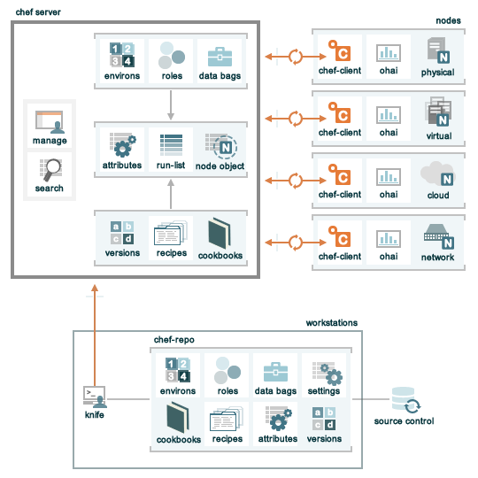

#Master Chef & Puppet Show
-----
---------


# Quoi?
# Comment?
## Quelque études de cas
# Pourquoi?


------
presenter's notes:

---


Chef et puppet sont deux solutions concurrentes (au sens commercial) de gestion de configuration de système (et non de code source). Bien que très "à la mode" et adopter massivement par de nombreuse compagnie, petit ou grande, leur rôle - et surtout l'intérêt, ne semble pas toujours évident pour de nombreux développeurs Java. C'est plus que regrettable, car c'est ce genre d'outil qui permettent justement de meettre en place une approche DevOps.

Nous allons donc rapidement lever le voile sur la nature de ces solutions, mais de manière pragmatique, en détaillant une paire de cas d'études concret, que nous avons rencontrés dans notre parcous professionnel, et que nous avons justement adressé à l'aide de, respectivement, Chef et Puppet.

Ces cas d'études parlerons au public Java de cette instance, car ils concerneront justement des
problématiques liées à la mise en place de logiciels 'back-end' java.

Et enfin nous conlurons par ce qui devrait alors vous paraite evident. Pourquoi Chef ? Pourquoi Puppet ?  Pourquoi cet engouement pour coder nos infrastructure ?

----
-----

## Quoi?

---
---

## Quoi?
### - Infrastructure

**Infrastructure** [in-fruh-struhk-cher]
nom féminin

.red[[1]] une collection de
* ressources:
 * réseaux, noeuds
 * systèmes de fichiers, fichiers, répertoires, liens symboliques, montages disques
 * utilisateurs, groupes
 * packages, logiciels, services
 * configuration

* agissant de concert

* pour fournir un service


[1] [Introduction to Chef](http://www.slideshare.net/JulianDunn/chef-introduction-princeton-meetup)

------
presenter's notes:

----

Avant de se lancer, tête la première cas d'étude (@FLD, le tien), on va déjà rappeler sommairement de quoi on parle ici, et qu'est ce que l'on entend exactement par le terme infranstrucute. En effet, à l'image de son grand frère "middleware", le terme infrastructure est utilisé un peu à toutes les sauces, et parfois même dans différents endroits d'une même architecture (Tiens, lui aussi c'est terme sur utilisé).

TODO: "lire le slide"

notes à déplacer:

Donc forcemment toujours sujet au changement...
on commence par un app server, une db
on ajoute un load balancer devant les app serveurs
puis on veut aussi du HA sur la base, puis sur les LBs
on scale, on passe a 2 load balancers
puis on rajoute du cache distribué
puis on doit maintenir ca par env,
monter des data centers par geographie

@FLD: comme on a dit on va mettre nos cas d'étude en // et décrire chacun des "grandes étapes" (installation, configuration et "production") pour chacun des cas. Donc dans mon cas d'études à moi , je pars du principe que tu as déjà parlé de l'installation de ton backend Java avec Jar.


---

# Cas #2 - Mise en place de JBoss Data Grid (JDG)
## JDG en quelques mots....
# Objectif(s):
## installer JDG v6 de manière automatisé
## mettre la bonne JVM
## Assurer une mise à jour aisée et automatique des binaires ("patching") du produit
## Disposer de plusieurs instances par machine, pour créer une "grille" avec un seul noeud
## Mettre en place le monitoring à l'installation


------
presenter's notes:

Alors de manière similaire au cas décrit par François, moi aussi, dans mon travail de tout les jours je dois assurer l'installation de "bouzin" en Java - et, étrangement, surtout ceux que Red Hat supporte (bizarrement, j'installe rarement du Spring...). Un de nos produits récent - et honnêtement, est JBoss Data Grid. Conçu pour remplacé JBoss Cache, ce produit permet de mettre en place une "grille de données". C'est donc, pour simplifier, une source de données de type NoSQL, qui distribue le stockage des données qu'on lui confie, sur plusieurs noeuds.

Ainsi, Data Grid peut aisément monter à l'échelle, car, si on a besoin de plus d'espace, on rajoute simplement des noeuds. Par la magie d'un algorithme de hashage, quelques soit le nombre de noeuds formant la grille, le programme client sera toujours en mesure de déterminer quel noeud possède son information. Bref, c'est génial, c'est "cloud", c'est "scalable", etc...

(dans la prochaine version, ça fera aussi le café et s'attaquera à la faim dans le monde)

Plus sérieusement, c'est bien gentil de monter en charge, mais si il me faut un admin et deux heures pour agrandir (ou réduire) la taille de ma grille, c'est quand même pas très, très pratique, il faut le reconnaitre. Pour tirer parti de cet aspect du produit, il est donc nécessaire de pouvoir automatiser, autant que possible, son installation et sa configuration.

En plus de permettre l'automatisation, il faut aussi pouvoir déployer aisément un correctif (un changement de binaire). JDG n'est pas, comme le backend de François, un simple jars. En effet, il s'execute sur un serveur JBoss AS et est donc fait de nombreux jars, mais aussi de fichier de configuration diverses. Une mise à jour, de securité ou non, peut affecter plusieurs de ces fichiers.

Enfin, comme pour François, il ne faut pas oublier notre ami la JVM. Avant même d'installer JDG, il faut bien s'assurer que cet outil d'infrastructure soit en place.

Alors, à la différence notable de son cas, nous chez Red Hat, on a peu cette habitude d'utiliser des RPMs ! D'ailleurs, c'est bien parce que Puppet, il est pas bête (oh la rime), et, par défaut, quand il faut installer quelque chose sur une RHEL ou une autre distribution à base de RPM, il utilise par défaut, RPM et yum. Alors, chouette, déjà c'est réglé, on package JDG sous forme de RPM - bidon, et on demande à Puppet de simpement l'installer.

Bon il faut

---

# Cas #2 - Puppet

node *-jdg.mygrid.com {

  $openjdk = 'openjdk-1.6.0'
  package { $openjdk:
    ensure => installed,
  }

  $jdg = 'jdg'
  package { $jdg:
    ensure => installed,
    require => Package[$openjdk]
  }

  service { $jdg:
    ensure => running,
    require => Package[$jdg],
  }
}

------
presenter's notes:

TODO: décrire le contenu du script à l'oral

Et voilà, le tour est joué, on vient déjà d'implémenter les deux premiers points de notre cahier des charges. On automatisé l'installation de JDG, et on s'est surtout assurer que notre logiciel dispose de la bonne "infrastructure" (ie la bonne jvm). En outre, permet d'assurer, lors de son exécution que non seulement le produit est installé, mais aussi que le service tourne ! Bon, avant d'attaquer la suite, je laisse François reprendre son cas d'étude à lui...

TODO: la "suite", pour la partie "conf du service"
- installation multi instance avec un seul "rpm binaire"
- mise en place du firewall/selinux
- configurer les instances pour n'utiliser qu'un fichier de configuration
- servir le fichier de conf depuis puppet
- mise en place du monit avec Jolokia

puis, pour la partie "prod"
- ajout d'une instance par noeud -> mise à jour fw
- ajout d'un cache dans la grille

---
---

## Quoi?
### - Infrastructure
### - Infrastructure as code


Chef & Puppet sont 2 solutions concurrentes
* de gestion de configuration
* d' * **Infrastructure as Code** *

Il ne remplacent pas juste tes scripts shell, il te permettent de:

* abstraire la facon dont tu manages ton infra
* de la coder
 * de la (re)construire à partir de serveurs 'nus'
* faire converger tes systèmes
* de façon idempotente
```
    EtatA --> Etat B --> Etat B
```
]

------
presenter's notes:

----


http://www.slideshare.net/jedi4ever/infrastructure-as-code-abug-session
http://architects.dzone.com/articles/infrastructure-code
https://www.youtube.com/watch?v=cuJZbRngWC0


---

## Quoi?
### - Infrastructure
### - Infrastructure as code
### - Puppet


Puppet:

- créé en 2005
- édité par PuppetLabs
- license TBD
- langage dédié (DSL)
- blablabla TBD


---

## Quoi?
### - Infrastructure
### - Infrastructure as code
### - Puppet
### - Chef


Chef:

- créé en 2009
- édité par Opscode/Chef
- license Apache
- écrit en Ruby
- langage dédié (DSL) et pure Ruby
- different modes
 * Chef solo
 * Chef zero
 * Chef server + client


------
presenter's notes:

----

https://www.ibm.com/developerworks/library/a-devops2/

Chef has been around since 2009. It was influenced by Puppet and CFEngine.
Chef supports multiple platforms including Ubuntu, Debian, RHEL/CentOS, Fedora, Mac OS X, Windows 7, and Windows Server.
It is often described as easier to use — particularly for Ruby developers,
because everything in Chef is defined as a Ruby script and follows a model that developers are used to working in.
Chef has a passionate user base, and the Chef community is rapidly growing while developing cookbooks for others to use.

chef-solo: http://docs.opscode.com/chef_solo.html
chef-solo is an open source version of the chef-client that allows using cookbooks with nodes without requiring access to a server. chef-solo runs locally and requires that a cookbook (and any of its dependencies) be on the same physical disk as the node. chef-solo is a limited-functionality version of the chef-client and does not support the following:

Node data storage
Search indexes
Centralized distribution of cookbooks
A centralized API that interacts with and integrates infrastructure components
Authentication or authorization
Persistent attributes

chef-zero : http://www.slideshare.net/mpgoetz/chefzero-local-mode

---
---


## Quoi?
### - Infrastructure
### - Infrastructure as code
### - Puppet
### - Chef


Chef

* réduit la complexité de la gestion d'une infrastructure par l'abstraction
 * *Organizations, Environments, Roles, Nodes, Run-List, Cookbooks, Recipes, Resource, Data Bags, Search*

* permet de persister et manager ces abstractions sous forme de code

* génère les configurations et provoque les installations directement sur les serveurs/ *Nodes* à partir des leur *Run-Lists*


---
---


# Comment
### Comprende Chef
### -  Panorama




------
presenter's notes:

----


http://docs.opscode.com/chef_overview.html
http://www.slideshare.net/opscode/week-1-overview-of-chef

---
---

## Chef Comment ?
### -  Panorama
### -  Abstractions


* Organisations
 * locataires independants du chef serveur (BU, Département)

* Environments
 * modèle votre cycle de release et vos process (dev, test, stage, prod)

* Roles
 * représente votre type de serveur (lb, JEE serveur, DB Serveur...)

* Nodes
 * vos serveurs (physique ou virtuel, sur votre réseau our sur le cloud)
 * sur lequel tourne `chef-client`


------
presenter's notes:

----


manager le complexité, et embrasser les abstraction offertes par Chef


Organization :

Completely independent tenants of Enterprise Chef
*  Share nothing with other organizations
*  May represent different
*  Companies
*  Business Units
*  Departments

Environments may include data attributes necessary
for configuring your infrastructure
*  The URL of your payment service’s API
*  The location of your package repository
*  The version of the Chef configuration files that
should be used


Roles may include a list of Chef configuration files
that should be applied.
*  We call this list a Run List
*  Roles may include data attributes necessary for
configuring your infrastructure
*  The port that the application server listens on
*  A list of applications that should be deployed

Nodes Adhere to Policy
• An application, the chef-client, runs on each node
• chef-client will
• gather current system configuration
• download the desired system configuration from
the Chef server
• configure the node such that it adheres to the
policy

http://www.slideshare.net/opscode/week-1-overview-of-chef

http://docs.opscode.com/chef_overview.html


---
---

## je n'ai qu'un simple jar
un micro service/site web
c'est auto suffisant

oui mais:
* installation en service
* monitoring de log
* HA
* apache dispatcher for static content
* security checklist
* elasticité

multiplié par le nombre d'env


---
---
## je veux protéger mes secrets

* chef-vault

---
---
## l'enfer des dépendances

* berkshelf

---
---


## Pourquoi?


---
---

## Pourquoi?
### - Transformation d'Adobe IT


- Adobe **Creative Cloud**
 * *'Accelerate, Simplify, Scale'*

- décloisonner les équipes, dev, de qualité, de sécurité et d'exploitation

- Comme notre infra devient code, elle devient
 * testable
 * versionable
 * jetable
 * repétable, *'cloud-ready'*


------
presenter's notes:

----


- Adobe IT
 * *Accelerate, Simplify, Scale*

- décloisonner les équipes, dev, de qualité et d'exploitation
 * faciliter, accélérer les changements
 * mieux garantir stabilité et sécurité
 * éviter les surprises

- Comme votre infra devient code, elle devient
 * testable
 * versionable
 * jetable
 * repétable

* http://sdarchitect.wordpress.com/2012/12/13/infrastructure-as-code/
* http://java.dzone.com/articles/infrastructure-code-key-devops
* http://architects.dzone.com/articles/infrastructure-code


---
---

## Pourquoi?
### - Transformation d'Adobe IT
### - Open Development


[@bdelacretaz](http://www.slideshare.net/bdelacretaz/open-development-in-the-enterprise-apachecon-na-2013) nous donnes 5 clefs:

 * Whatever you're working on, it must be backed by an issue in the tracker.

 * **If it's not in the source code control system, it doesn't exist.**

 * If it's important, it needs a permanent URL.

* If it didn't happen on the dev list, it didn't happen.

* What happened while you were away? Check the activity stream and archives.
]


------
presenter's notes:

----

Who needs secrets?
Who cares if your code is not yet perfect?

* http://www.slideshare.net/bdelacretaz/open-development-in-the-enterprise-apachecon-na-2013

without trust, the tools don't matter

* http://www.slideshare.net/JulianDunn/chef-introduction-princeton-meetup

---
---

## Pourquoi?


* TBD


---
---
